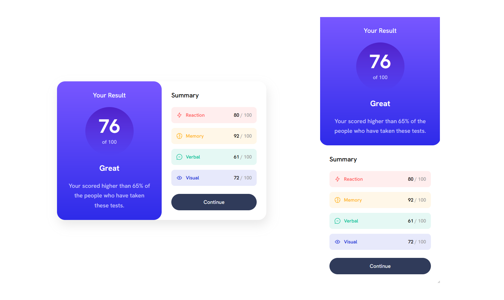

# Frontend Mentor - Results summary component solution

This is a solution to the [Results summary component challenge on Frontend Mentor](https://www.frontendmentor.io/challenges/results-summary-component-CE_K6s0maV). Frontend Mentor challenges help you improve your coding skills by building realistic projects. 

## Table of contents

- [Overview](#overview)
  - [The challenge](#the-challenge)
  - [Screenshot](#screenshot)
  - [Links](#links)
  - [My process](#my-process)
  - [Built with](#built-with)
  - [What I learned](#what-i-learned)
  - [Continued development](#continued-development)
  - [Useful resources](#useful-resources)
- [Author](#author)

## Overview

### The challenge

Users should be able to:

- View the optimal layout for the interface depending on their device's screen size
- See hover and focus states for all interactive elements on the page

### Screenshot

### Links

- Solution URL: [Solution](https://github.com/IbrRagab/Results_Summary_Component_Main)
- Live Site URL: [live site](https://ibrragab.github.io/Results_Summary_Component_Main)

## My process

### Built with

- Semantic HTML5 markup
- CSS custom properties
- Flexbox
- Media Queries
- Mobile-first workflow

### What I learned

During the process of completing this coding challenge, I had the opportunity to dive deep into various aspects of front-end development. Here are the key learnings from my experience:

Flexbox Mastery: I gained extensive practice in utilizing Flexbox for layout design, enabling me to create flexible and responsive designs with ease.

Harnessing CSS Custom Properties: I learned how to leverage CSS custom properties (CSS variables) to centralize values and improve code efficiency and maintainability.

Exploring CSS Grid and Building Foundations: I developed a solid foundation in CSS Grid, enabling me to create grid-based layouts and organize designs more effectively.

Beginning Responsive Design Journey: I started my journey towards understanding and implementing responsive design principles, experimenting with media queries to adapt layouts to different devices.

Expanding Knowledge of CSS Selectors: I deepened my knowledge of advanced CSS selectors, allowing me to target elements precisely and apply styles efficiently.

### Continued development

Completing this coding challenge has sparked my enthusiasm for continuous growth and improvement. Moving forward, I have identified the following areas to focus on:

Advancing CSS Grid skills: I will delve deeper into CSS Grid, exploring advanced features like grid auto-placement and nested grids to create more dynamic and responsive layouts.

Refining responsive design techniques: I plan to deepen my understanding of media queries and explore advanced responsive design patterns to ensure seamless experiences across devices.

Mastering CSS selectors: By expanding my knowledge of CSS selectors, including combinators and pseudo-elements, I aim to write more efficient and targeted stylesheets.

Enhancing layout design skills: I will invest time in studying modern layout techniques like Flexbox and CSS Grid, as well as exploring emerging frameworks and libraries.

### Useful resources

- [Resource 1](https://elzero.org/tracks/front-end) 
- [Resource 2](https://www.youtube.com/@ElzeroWebSchool)
## Author
- Frontend Mentor - [@IbrRagab](https://www.frontendmentor.io/profile/IbrRagab)
- GitHub - [@IbrRagab](https://github.com/IbrRagab)
